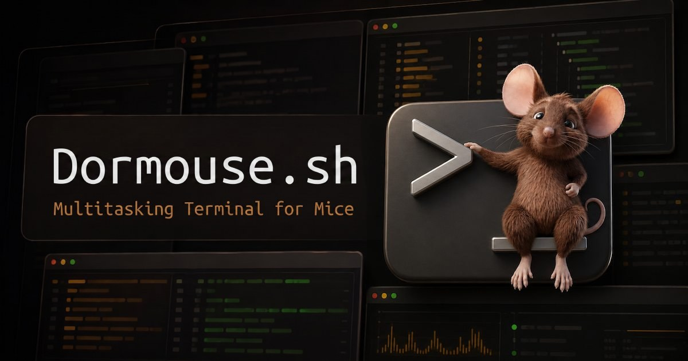
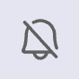
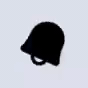

# Dormouse

A multitasking terminal for VS Code and the desktop — a real tiling layout, tmux keybindings, full mouse support, browser panes your agents can drive, and alerts that tell you when something needs you.



[dormouse.sh/playground](https://dormouse.sh/playground) — try the real thing in your browser, nothing to install.

## Get Dormouse

- **VS Code** — install from the [Visual Studio Marketplace](https://marketplace.visualstudio.com/items?itemName=diffplug.dormouse) or [Open VSX](https://open-vsx.org/extension/diffplug/dormouse). Also works in Cursor, Windsurf, and other VS Code forks.
- **Standalone** — self-updating installers for macOS, Windows, and Linux at [dormouse.sh](https://dormouse.sh/#download).
- **Playground** — [dormouse.sh/playground](https://dormouse.sh/playground) runs the real interface in your browser.

Both hosts run the same terminal, the same layout engine, and the same alerts.

## Layout and panes

Run builds, agents, servers, and scripts side by side. Split, resize, swap, and zoom panes with the mouse or the keyboard.

Minimize the panes you aren't watching down to a compact status indicator on the baseboard — a **door**. A minimized pane keeps running and keeps reporting, so a door still shows you when its task needs attention. Reattach it and you are back where you left off.

You can spawn and rearrange everything using any of:

- default tmux shortcuts
- Dormouse's own shortcuts
- the mouse

## Alerts and TODOs

Dormouse can owe you attention in three independent ways. Two of them need no setup at all.

**A program asks for you.** Dormouse understands the standard terminal notification and progress protocols — `BEL`, `OSC 9`, `OSC 9;4`, `OSC 99`, and `OSC 777`. Any tool that already signals completion or progress rings its pane, with no configuration.

**A command finishes while you are away.** If a foreground command was running while you were watching, you left, and it exited after you had been gone a while, that pane is ringing when you come back. Also no configuration.

**A watched command goes quiet.** This one is opt-in, and it is the one for coding agents. Click the bell in a pane running `claude` — or press `a` in command mode — and Dormouse watches *that command name*. Every pane running `claude` is then watched, the ones open now and the ones you open later. When a watched command's output goes busy and then falls quiet while you are not looking, it rings.

Dormouse never guesses which commands deserve an alert. Watching is a rule you create on a command name, and turning it off anywhere removes it everywhere.

-  no watch rule for this pane's command
-  this command is watched
-  a watched command is running; it will alert when it goes quiet
-  finished, and it needs your attention

Whichever way a pane rings, the ring becomes a **TODO** — a marker beside the pane's title that outlives the alert, so a ring you dismissed does not disappear without a trace. Clear it by clicking it or pressing `t` in command mode.

Spoken alarms use your browser or system voice today. An optional [managed ElevenLabs voice](https://dormouse.sh/hosted/#voice) is coming for people who want something more natural without managing a separate voice account.

Watching a command's output requires shell integration (`OSC 633` / `OSC 133`) so Dormouse can tell where one command ends and the next begins. Shells that do not report command boundaries — `cmd.exe`, `fish`, or any shell where the integration did not take — never engage watching. The protocol and command-exit alerts above work regardless.

## Browsers for you and your agents

A browser is just another pane. Put your dev server next to the terminal running it, in the same tiling layout.

```
dor ab open surface:2
```

That aims a browser pane at the port a terminal surface is serving. Your agents run the same command, so when an agent wants to look at what it just built, it opens a pane you are already watching.

Browser panes render three ways: a live Chromium stream inside the pane, popped out to a real OS window when you need the genuine article, or a lightweight proxied iframe. Dormouse is a client for the `agent-browser` you already have installed — it does not ship a browser of its own.

See [`/docs/dor#agent-browser`](https://dormouse.sh/docs/dor#agent-browser) for the full command reference.

## Mouse, selection, and copy/paste

Click and drag in most terminals does not select text — it fires a mouse escape sequence at whatever is running. Dormouse notices when a TUI such as `htop` or `neovim` has grabbed the mouse and gives you a one-click override, so you can select the thing.

Then copy it the way you meant it:

- **Copy Raw** keeps the hard wraps exactly as the terminal drew them.
- **Copy Rewrapped** joins those wrapped lines back into the line the program actually printed.


Hold `Alt` while dragging to toggle between block and linewise selection, and press `e` mid-drag to extend the selection out to the whole URL or file path.

## Keyboard shortcuts

Dormouse starts in **passthrough** mode, where every keypress goes to the selected terminal. Tap **left Shift then right Shift** within half a second to enter **command** mode, where keys drive the layout instead. Left Cmd then right Cmd works too (left Win / left Super on Windows and Linux).

| Key | Action |
|-----|--------|
| `Enter` | Return to passthrough mode |
| `\|` or tmux `%` | Split left/right |
| `-` or tmux `"` | Split top/bottom |
| Arrow keys | Move selection between panes |
| `Cmd`/`Ctrl` + arrows | Swap terminals between two panes |
| `z` | Zoom / unzoom the selected pane |
| `m` or tmux `d` | Minimize pane to a door, or reattach one |
| `k` or tmux `x` | Kill pane (asks you to confirm) |
| `,` | Rename pane |
| `a` | Toggle the alert rule for the running command |
| `t` | Toggle the TODO marker |
| `>` | Open the pane header menu, including bound ports |

Copy and paste keep their usual bindings in both modes: `Cmd+C` / `Ctrl+C` copies raw, `Cmd+Shift+C` / `Ctrl+Shift+C` copies rewrapped, and `Cmd+V` / `Ctrl+V` pastes. On macOS, `Ctrl+C` still passes through to the running program.

The complete table lives in [the keyboard shortcut reference](https://github.com/diffplug/dormouse/blob/main/docs/specs/shortcuts.md).

## Themes and host integration

Inside VS Code, Dormouse uses your VS Code theme — colors, styling, everything. Switch themes and Dormouse switches with you. No separate configuration and no mismatched colors.

The standalone app ships the same theme system with its own picker, so a layout you like looks the same in both places.

## Getting started

### VS Code

1. Install the extension.
2. Open the command palette (`Cmd+Shift+P` / `Ctrl+Shift+P`).
3. Run one of:
   - **Dormouse: Focus** — open Dormouse in the Panel area, next to the built-in terminal.
   - **Dormouse: Open in Editor** — open Dormouse as an editor tab. You can open several.
   - **Dormouse: New Terminal** — add a terminal to the active Dormouse.
   - **Dormouse: Select Shell** — pick which shell new terminals launch.

Dormouse works in the Panel area, the Editor area, or both at once.

### Standalone

1. Download an installer for your platform from [dormouse.sh](https://dormouse.sh/#download).
2. Launch it. The app updates itself, so there is nothing further to wire up.

## Automation and agents

Every terminal Dormouse launches has `dor` on its `PATH` — a small CLI that talks to the Dormouse hosting it. It lets a script, or an agent, drive the layout:

```
dor list                      # what surfaces exist
dor ensure -- pnpm dev        # make sure this is running, exactly once
dor split -- pnpm test        # open a new terminal pane
dor ab open surface:2         # open a browser on that terminal's port
```

`dor ensure` is idempotent: run it twice and the second call reuses the pane already running that command in that directory instead of starting a second copy.

Dormouse also bundles an agent skill describing all of this in the form agents expect. Run `dor skill` to print it, or `dor skill --install` to install it for the agent in your current project.

- [Complete CLI reference](https://dormouse.sh/docs/dor)
- [The bundled agent skill](https://dormouse.sh/docs/agent-skill)

## Help and project links

- [Browser playground](https://dormouse.sh/playground) — no install required
- [Dormouse Hosted](https://dormouse.sh/hosted/) — upcoming managed remote control and voice
- [Report an issue](https://github.com/diffplug/dormouse/issues)
- [Source on GitHub](https://github.com/diffplug/dormouse)
- [Supply chain](https://dormouse.sh/supply-chain)
- Brought to you by [DiffPlug](https://www.diffplug.com/)
